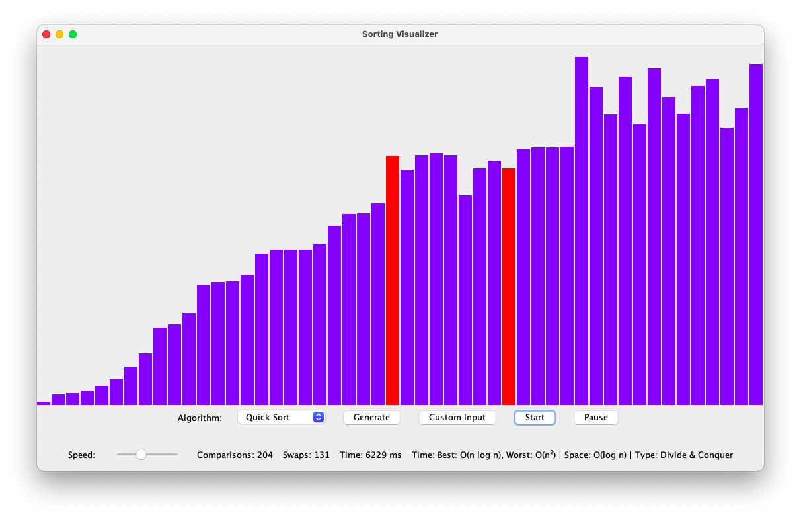

# 🔢 Sorting Visualizer

A Java-based tool to visualize and analyze sorting algorithms in real-time.

---

## 🚀 Features

- 9 Sorting Algorithms:
  - Bubble Sort  
  - Selection Sort  
  - Insertion Sort  
  - Merge Sort  
  - Quick Sort  
  - Heap Sort  
  - Counting Sort  
  - Radix Sort  
  - Bucket Sort  

- Real-time visualization  
- Speed control  
- Pause / Resume functionality  
- Comparisons & swaps tracking  
- Execution time measurement  
- Time & Space complexity display  
- Algorithm classification  
- Custom user input support  

---

## 🛠️ Tech Stack

- Java  
- Swing (GUI)  

---

## 📊 Architecture

GUI → Visualizer → SortingAlgorithms → Analyzer  

---

## ▶️ How to Run

1. Compile all `.java` files  
2. Run `Main.java`  

---

## 📸 Preview

  

---

## 📌 Project Type

Design & Analysis of Algorithms (DAA) Project